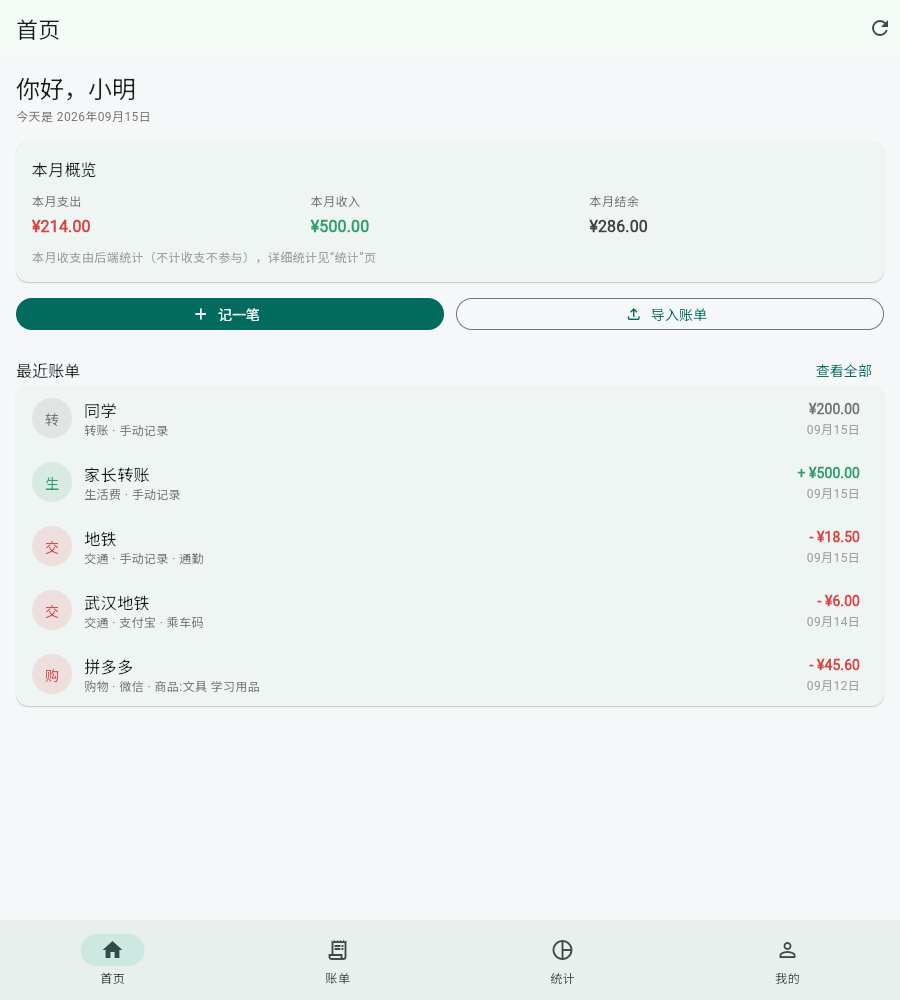
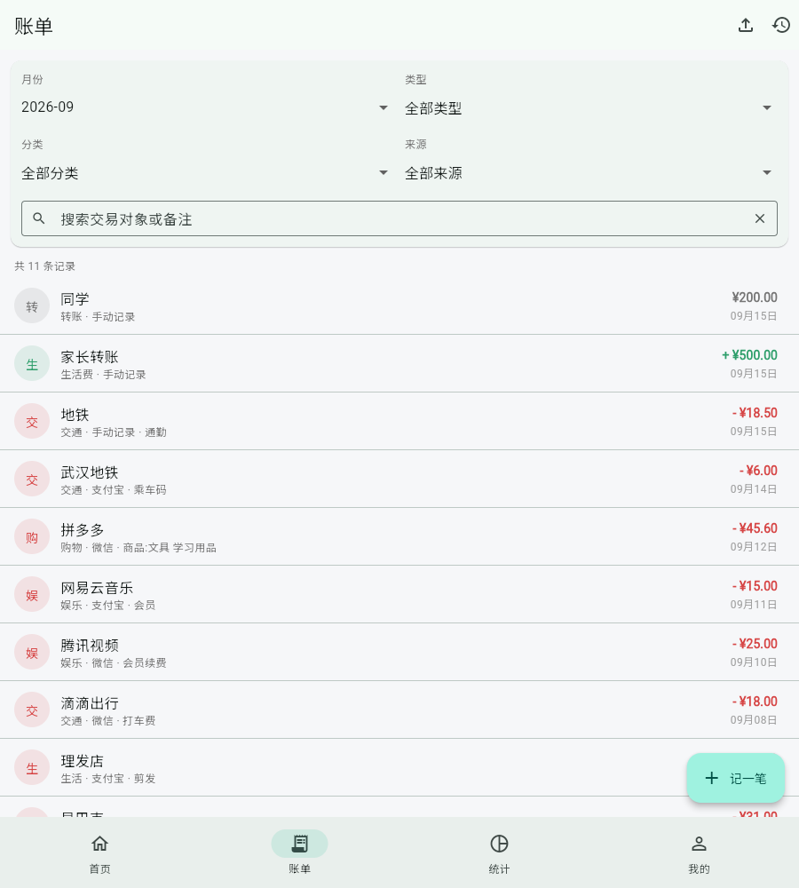
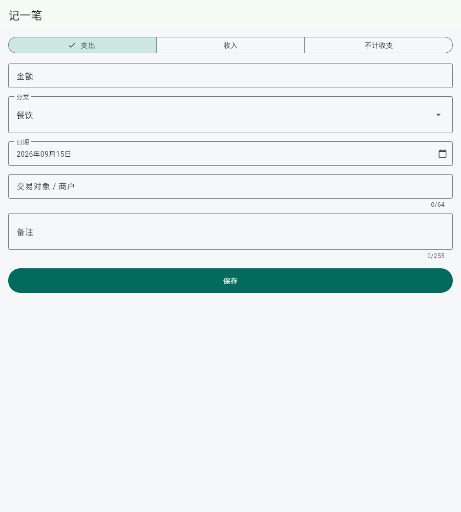
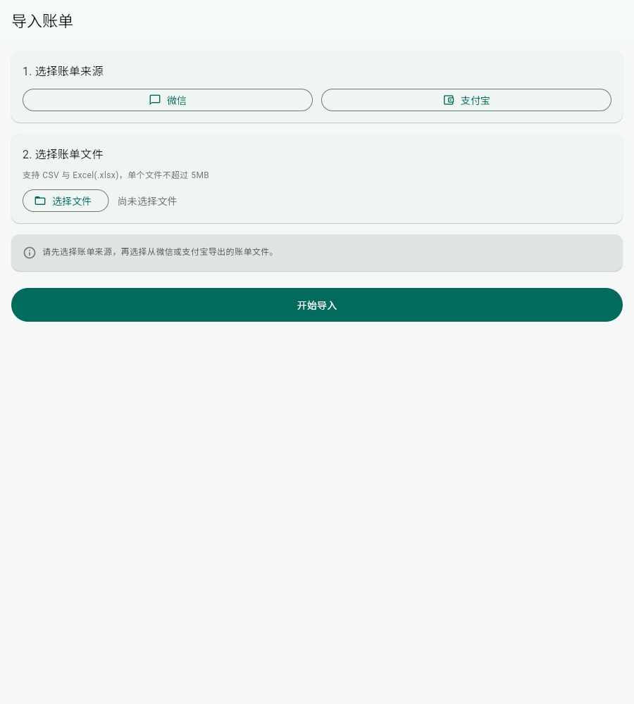
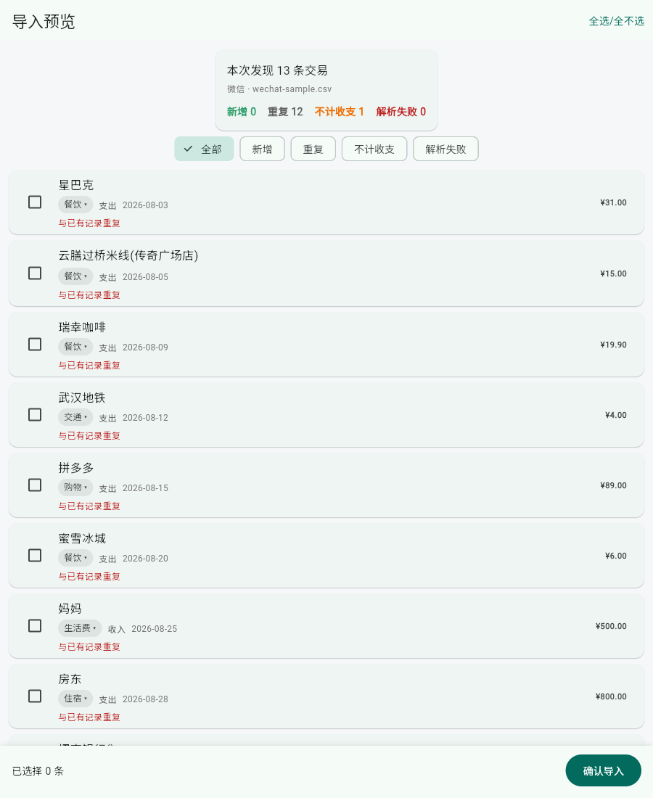
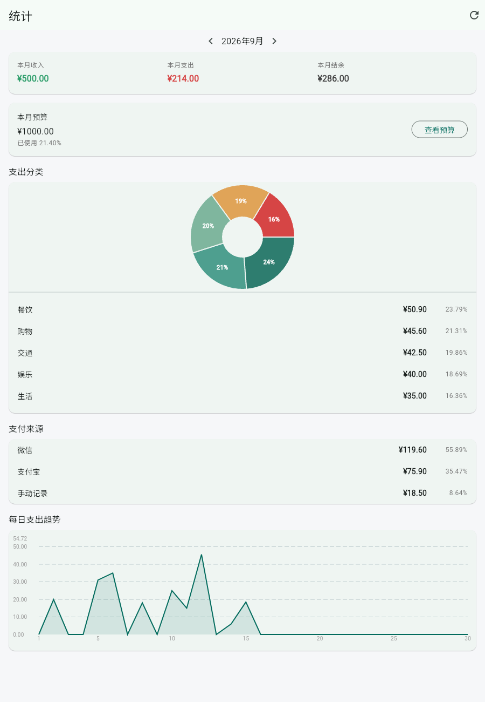
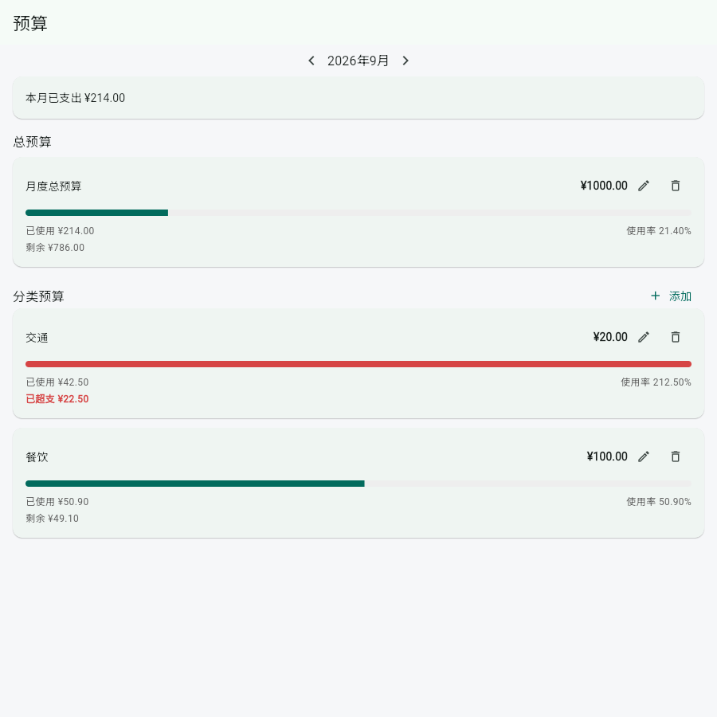
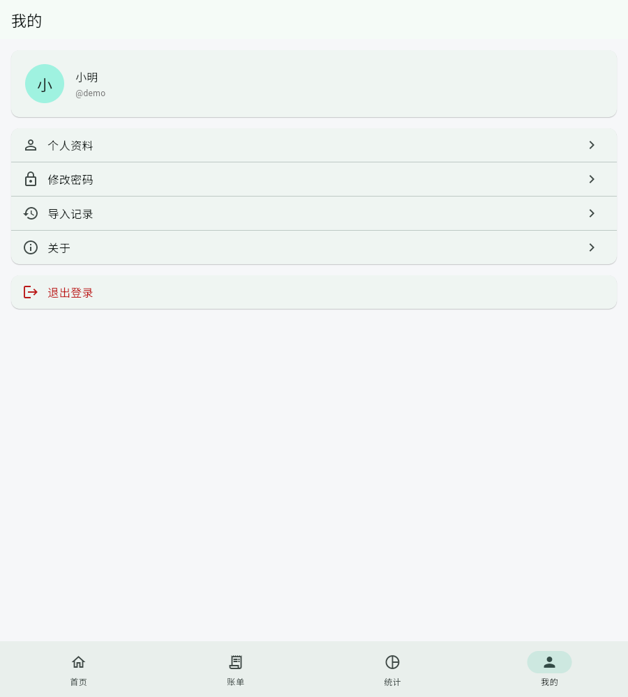

# 福瑞记账（Furui Bookkeeping）

> 记下每一笔 · 收获更好的自己
>
> 面向在校大学生的个人记账系统：支持手动记账、微信/支付宝账单导入、收支统计与预算管理。
> 课程设计 / 毕业设计项目，技术栈为 Spring Boot + MySQL + Flutter Web。

项目代号仍然是 **Campus Ledger**：Dart 包名 `campus_ledger`、Java 包 `com.campus.ledger`、
数据库名与接口路径都保持原名，"福瑞记账"是面向用户展示的品牌名称。

---

## 一、项目介绍

大学生的生活费来源固定（家庭转账、奖助学金、兼职），支出集中在餐饮、交通、购物、娱乐、学习等少数几类，特点是**单笔金额小、笔数多、几乎全部通过微信/支付宝支付**。手工记账难坚持，而移动支付账单虽然记录了每一笔，却看不出"钱花在哪了"。

本项目解决两个问题：

1. **记账省事**：把微信 / 支付宝导出的官方账单文件导入系统，自动解析成记账记录（自动判断收支、识别金额与交易号、推荐分类、过滤重复）。
2. **看清去向**：月度收支结余、分类占比、每日趋势、支付来源构成，以及月度总预算与分类预算的执行情况。

**关于账单导入的合规说明**：系统不登录用户的微信/支付宝账号，不使用任何私有接口、Hook、逆向或模拟登录。用户在自己手机上按官方流程导出账单文件后上传，系统只负责解析这个文件。

---

## 二、系统功能

### 1. 用户与认证

| 功能 | 说明 |
| --- | --- |
| 注册 / 登录 | 用户名 + 密码，密码使用 BCrypt 哈希存储 |
| JWT 鉴权 | 除注册登录外的接口都需要 `Authorization: Bearer <token>` |
| 个人资料 | 查询与修改昵称、邮箱 |
| 修改密码 | 需验证旧密码，成功后前端清除 token 要求重新登录 |
| 数据隔离 | 所有账单、预算、导入记录、统计只查当前登录用户的数据 |

### 2. 账单管理

增删改查、按月份/类型/分类/来源/关键词筛选、分页、详情查看；支出与收入用不同颜色区分，列表显示"分类 · 来源"。

列表按日期分组展示，分组标题是"今天 / 昨天 / 09月15日"并带当天收支合计；筛选支持金额区间
（最小金额 ~ 最大金额）；详情页与编辑页都会展示账单来源（手动记录 / 微信 / 支付宝），
导入的账单不允许改成手动。

列表支持**左滑删除**（确认后删除，失败自动回滚）；空状态区分"还没有记账记录"与
"没有找到相关账单"（后者可一键清除筛选条件）；首页有悬浮的**快速记账**入口，
金额自动聚焦、分类点选即可保存。

### 3. 数据导出

「我的 → 数据导出」或账单页右上角可以把自己的账单导出为 CSV / Excel / JSON，
导出完成后会提示文件名与条数。只导出当前登录账号的数据；单次最多 10000 条，
超出时会提示"账单数量过多，请按月份导出"。

### 4. 账单导入（微信 / 支付宝）

选择来源 → 选择文件 → 解析 → 预览 → 确认导入 → 结果页，另附导入历史。

- 支持 UTF-8（微信）与 GBK/GB18030（支付宝）账单，自动探测编码；
- 通过表头定位 + 列名映射解析，不依赖固定列号；
- 自动分类：支付宝自带交易分类映射 + 关键词匹配，结果可在预览页修改；
- 去重：优先用原始交易号，没有交易号时用组合指纹，数据库唯一键兜底；
- 支持 CSV 与 Excel(.xlsx)，单文件 ≤ 5MB、单次 ≤ 2000 条；
- 异常文件（空文件、错误表头、损坏文件、商户版账单等）返回中文提示，不会 500。

### 5. 统计

| 统计项 | 说明 |
| --- | --- |
| 月度概览 | 本月收入、支出、结余 |
| 分类支出 | 各分类金额与占比（环形图 + 明细，按金额降序） |
| 支付来源 | 微信 / 支付宝 / 手动记录的支出金额与占比 |
| 每日趋势 | 整月每天的收入与支出（折线图，无交易为 0） |

统计口径：只统计 `type=1`（支出）与 `type=2`（收入），`type=3`（不计收支，如转账、提现、还款）不参与任何统计。

### 6. 预算

月度总预算与分类预算，显示预算金额、已使用、剩余、使用率与进度条，超出时提示"已超支 ¥xx"。

### 7. 智能记账与消费洞察

系统用「规则 + 用户历史行为 + 统计分析」实现本地智能能力，**不接入任何大模型，不产生额外费用**：

- **分类推荐**：根据你自己过去对同一商户的分类记录推荐分类，并给出依据（例如"根据你过去 3 次对该商户的记录"）、
  可信度（高可信 / 中等可信 / 仅供参考）与评分。没有足够历史时只显示引导文案，不会给虚假推荐。
  推荐只是建议，要点「使用推荐」并保存才会生效。
- **消费洞察**：统计页按预算超支、大额消费、分类增长、整体变化、消费结构等规则生成最多 5 条
  可解释结论；首页只展示一句话摘要，点「查看消费分析」进入统计页看完整内容。

所有智能能力只读取当前登录用户自己的账单，不会读取他人的历史。

### 8. 智能预算预测

在预算管理的基础上增加**消费趋势预测**：系统按本月已经过去的消费节奏，推算月末可能花掉多少，
再结合你设置的预算给出风险提醒。

- **只基于你自己的账单与预算**：全部计算来自当前登录用户的 `bill` 与 `budget` 数据；
- **不调用任何外部服务、不使用大模型**：纯粹是算术推算加阈值分级，每条结论都能手工复核；
- **后端计算、前端展示**：金额与风险等级都由后端算好返回，前端只负责排版与配色；
- **只在当前月份生效**：历史月份与未来月份返回「仅支持预测本月支出」，不给出虚假预测；
- **数据不足时不出结论**：本月有消费的天数少于 3 天时，只显示「已使用 / 预算」的事实，
  不显示预测金额，避免月初一两笔消费被放大成误报。

首页在「本月消费概览」下方最多展示 2 条最关键的预测（按风险从高到低取），统计页展示全部分类预算。

#### 预测算法

```text
已过天数 elapsedDays        = 当天的日号（最多取到当月总天数）
日均支出 dailyAverage       = 本月已支出 ÷ elapsedDays（保留两位小数，四舍五入）
月末预测 projected          = dailyAverage × 当月天数
预计超支 projectedOver      = max(projected − 预算, 0)
预计使用率 projectedUsageRate = projected ÷ 预算 × 100
预计触顶日期 overDate       = ceil(预算 ÷ dailyAverage) 对应的那一天（超出当月则不返回日期）
```

举例（2026-09-17 查看，当月 30 天、已过 17 天；餐饮预算 600 元、本月已花 500 元）：

```text
日均   = 500 ÷ 17        = 29.41
月末   = 29.41 × 30      = 882.30
超支   = 882.30 − 600    = 282.30
使用率 = 882.30 ÷ 600    = 147.05%
触顶   = ceil(600 ÷ 29.41) = 第 21 天 → 2026-09-21
```

口径说明：日均只用**本月**数据，不掺入上月，这样用户自己用计算器就能验证；
代价是月初基数小、对突发大额敏感，这一点由「消费天数不足 3 天不出结论」兜住。

#### 风险等级

风险按**预测使用率**分级。这里没有用「当前已用比例」，因为月初花掉一半并不代表一定超支，
推算到月底才是有意义的信号。

| 预测使用率 | 等级 | 页面文案 |
| --- | --- | --- |
| 小于 60% | `SAFE` | 安全 |
| 60% ~ 85% | `LOW` | 留意 |
| 85% ~ 100% | `MEDIUM` | 接近预算 |
| 100% ~ 120% | `HIGH` | 预计超支 |
| 120% 及以上 | `OVER` | 严重超支 |

后端只返回等级字符串，颜色、图标与中文文案由 Flutter 决定。

#### 状态说明

| 状态 | 含义 | 页面表现 |
| --- | --- | --- |
| `OK` | 预测可用 | 展示预测卡片 |
| `INSUFFICIENT_DATA` | 有预算但本月消费天数不足 3 天 | 只显示「已使用 ¥x / 预算 ¥y」，不显示任何预测结论 |
| `NO_BUDGET` | 本月没有设置预算 | 提示「还没有设置预算」并提供「去设置」按钮 |
| `NOT_APPLICABLE` | 不是当前月份 | 提示「预算预测仅支持当前月份」 |

### 9. 智能周期性支出识别

从你自己的历史账单中找出「会重复发生」的消费，例如每月自动续费的会员、每月固定的话费、每周固定的通勤。

- **只基于用户自身账单数据**：全部输入是当前登录用户的 `bill` 记录；
- **不调用外部服务、不使用大模型**：纯粹是间隔统计加阈值判断，每条结论都能手工复核；
- **后端实时计算、前端展示结果**：识别结果**不落库**，每次请求都按当前账单重新计算；
- **只读分析、不修改账单**：识别过程不写任何数据，即使算法出错也不会影响你的账本。

#### 识别范围

| 周期 | 含义 | 是否支持 |
| --- | --- | --- |
| `WEEKLY` | 每周一次 | **支持** |
| `BIWEEKLY` | 每两周一次 | **支持** |
| `MONTHLY` | 每月一次 | **支持** |
| `DAILY` | 每天一次 | **不支持**（食堂、公交属于日常习惯，不是周期账单） |
| `QUARTERLY` | 每季度一次 | **不支持**（180 天窗口内样本必然不足） |

#### 算法说明

```text
数据窗口：最近 180 天
最低样本：同一商户 ≥ 4 次

账单查询（一次范围查询）
        ↓
商户归一化（去空格、统一小写、剥离长后缀）
        ↓
商户分组（商户为空的记录跳过）
        ↓
样本过滤（少于 4 次、平均间隔小于 5 天的一律剔除）
        ↓
周期判断（用中位数间隔匹配周期区间）
        ↓
信号评分（四个信号）
        ↓
置信度输出（4 个信号=HIGH，3 个=MEDIUM，≤2 个不返回）
```

#### 周期判断公式

对同一商户的账单按日期升序排列，计算相邻日期间隔，取**中位数**匹配周期（中位数比平均数抗异常值）：

| 周期 | 目标间隔 | 容许区间 |
| --- | --- | --- |
| `WEEKLY` | 7 天 | **5 ~ 10 天** |
| `BIWEEKLY` | 14 天 | **12 ~ 17 天** |
| `MONTHLY` | 30 天 | **26 ~ 35 天** |

三个区间互不重叠，一组数据只能落进一个周期。除中位数外还要求**区间覆盖率 ≥ 60%**（落在区间内的间隔占比），避免间隔杂乱时中位数偶然落进区间造成误判。

#### 四信号模型

每条候选计算四个信号，全部可解释：

| 信号 | 通过条件 |
| --- | --- |
| 间隔稳定 | 每一次相邻间隔都落在该周期的容许区间内 |
| 金额稳定 | 变异系数 `CV ≤ 0.15`（CV = 标准差 ÷ 平均金额） |
| 商户一致 | 归一化后商户名完全相同（分组前提） |
| 分类一致 | 同一商户的分类占比 `≥ 80%`，按主导分类统计 |

#### 置信度

| 通过信号数 | 置信度 | 是否返回 |
| --- | --- | --- |
| 4 个 | `HIGH` | 返回 |
| 3 个 | `MEDIUM` | 返回 |
| ≤ 2 个 | — | **不返回**（不输出低可信结论，避免误导） |

#### 状态说明

| 状态 | 含义 | 页面表现 |
| --- | --- | --- |
| `OK` | 识别到至少 1 项周期支出 | 展示周期卡片 |
| `NO_DATA` | 窗口内支出账单少于 5 条 | 「记录还太少」，引导继续记账 |
| `NO_RECURRING` | 数据量与时间跨度都满足，但没发现周期 | 「暂未发现明显周期性支出」 |
| `NOT_ENOUGH_HISTORY` | 有账单但最早一笔距今不足 60 天 | 「使用 3 个月以上后，这里会显示周期性支出」 |

首页在「智能预算预测」下方最多展示 1 条（按置信度、下次日期、金额排序后的第一条），且只在存在 `HIGH` / `MEDIUM` 时显示；统计页在预算预测与消费洞察之间展示全部识别结果。

### 10. 智能消费异常检测

先用你自己的历史消费算出「什么算正常」，再看指定月份里哪些消费偏离了这个常态。

- **只分析当前登录用户自己的账单**：用户身份来自 JWT（`CurrentUser`），**不接受前端传入 `userId`**；
- **不调用外部服务、不使用大模型**：全部是统计阈值判断，每条结论都能手工复核；
- **后端实时计算、前端展示**：结果**不落库**，每次请求按当前数据重新计算；
- **只读分析、不修改账单**：检测过程不写任何数据；
- **没有新增数据库表、字段或索引**：仍然只有 `user` / `bill` / `budget` / `import_batch` 四张表；
- **最多返回 5 条**，排序规则为「严重度降序 → 差额降序 → 分类字典序」；严重度只有 `HIGH` / `MEDIUM` 两级。

#### 三类异常

| 类型 | 检测什么 | 基线 | 触发条件 | 严重度 |
| --- | --- | --- | --- | --- |
| `CATEGORY_SPIKE` | 某分类本月金额明显高于往常 | 前 3 个自然月中**有消费月份**的金额平均值（没有消费的月份不按 0 计入） | `current ≥ baseline × 1.5` 且 `current − baseline ≥ ¥100` | `HIGH`：`current ≥ baseline × 2.5`；`MEDIUM`：`current ≥ baseline × 1.5` |
| `LARGE_TRANSACTION` | 本月出现一笔明显高于该分类日常水平的消费 | 目标月**开始之前** 90 天内同分类单笔金额的中位数（样本 ≥ 5 笔才判） | `amount ≥ median × 3` 且 `amount − median ≥ ¥100` | `HIGH`：`amount ≥ median × 5`；`MEDIUM`：`amount ≥ median × 3` |
| `FREQUENCY_SPIKE` | 某分类本月笔数明显变多 | 前 3 个自然月中**有消费月份**的平均笔数（`≥ 2` 笔才判） | `currentCount ≥ baselineCount × 2` 且 `currentCount − baselineCount ≥ 5` | `HIGH`：`≥ baselineCount × 3`；`MEDIUM`：`≥ baselineCount × 2` |

单笔异常的基线窗口是**目标月之前**的 90 天，**目标月的账单不参与自己的基线计算**：
如果把本月账单也算进中位数，一笔异常大额会把基线抬高，它自己反而达不到 3 倍门槛，造成漏报。
因此取数范围是「目标月开始前 90 天 ~ 目标月月末」，算基线时只取目标月之前的那一段。
商户为空的账单不会被丢弃，展示时用「分类 + 日期」定位。

#### 状态说明

| 状态 | 含义 | 页面表现 |
| --- | --- | --- |
| `OK` | 检测到至少 1 条异常 | 最多展示 5 张异常卡片 |
| `NO_DATA` | 目标月份没有支出记录 | 「本月还没有支出记录」 |
| `NOT_ENOUGH_BASELINE` | 本月有支出，但前 3 个月没有可用于对比的基线数据 | 「积累几个月数据后，这里可以对比出消费异常」 |
| `NO_ANOMALY` | 基线可用，但没有发现异常 | 「本月消费节奏正常」 |

#### 展示位置

只在**统计页**展示，位置在「周期性支出提醒」与「本月消费洞察」之间：

```text
本月概览 → 收支结余分析 → 预算卡 → 智能预算预测 → 周期性支出提醒 → 消费异常提醒 → 下月支出预估 → 本月消费洞察 → 分类统计 → 来源统计 → 消费对象分析 → 消费节奏分析 → 趋势图
```

**首页不展示消费异常提醒**，避免首页信息过载。

#### 实现位置

后端由独立服务 `SpendingAnomalyService` 承担（不放进负责月度结构性洞察的 `InsightsService`），
控制器 `InsightsController` 新增 `GET /api/insights/anomalies`；
查询由 `BillMapper.sumByCategoryAndMonth`（分类月度聚合，一次覆盖目标月 + 前 3 个月）与
`BillMapper.selectExpenseDetails`（支出明细，用于算中位数基线）提供，固定 2 次查询、无 N+1。
前端在 `pages/statistics_page.dart` 接入区块，模型与组件为 `models/spending_anomaly.dart`、
`widgets/anomaly_card.dart`。

### 11. 智能下月支出预估

在**不依赖任何预算**的前提下，用你过去几个月的消费节奏，预估**下一个月**大概会花多少。

#### 与「智能预算预测」的区别

| 维度 | Stage 4-A 智能预算预测 | Stage 4-D 智能下月支出预估 |
| --- | --- | --- |
| 回答的问题 | 这个月会不会超出预算 | 下个月大概要花多少钱 |
| 时间方向 | 本月 → 本月月末 | 本月 → 下个月 |
| 是否依赖预算 | **依赖**（没有预算就不给结论） | **不依赖**（只看历史账单） |
| 结果形态 | 每个预算一条风险提示（是否超支、何时触顶） | 一条总量预估 + 置信度 + 依据 |

两者互补：有预算时可以看到"这个月会不会超"，没有预算时仍然能看到"下个月大概花多少"。

#### 算法

```text
数据窗口：参考月之前 6 个完整自然月 + 参考月（一次聚合查询覆盖 7 个自然月）
有效月份：该月支出合计 > 0（没有支出的月份不按 ¥0 计入）
样本：最近 3 个有效完整自然月，按时间倒序权重 3 : 2 : 1
异常月：某月金额 > 中位数 × 2 → 该月权重降为 1，且置信度最高只能到 MEDIUM
预测：(m1 × 3 + m2 × 2 + m3 × 1) / 6
```

权重取 3 : 2 : 1 的理由：最近的月份最能代表当前消费习惯，同时保留前两个月的参考价值，
而且是用户能手工复核的整数比。

**当前月不参与预测**：即使本月已经记了很多账，它也只作为"本月已支出"的事实展示，不进入样本。

#### 置信度

| 置信度 | 条件 | 前端文案 |
| --- | --- | --- |
| `HIGH` | 极差比 `(最高月 − 最低月) ÷ 预估值 ≤ 0.30` | 较稳定 |
| `MEDIUM` | 极差比 `≤ 0.60`，或样本中存在异常月 | 一般 |
| `LOW` | 极差比 `> 0.60` | 波动较大 |

置信度只由客观条件（样本月份数、月份之间的波动幅度、是否存在异常月）决定，
并且始终把依据展示给用户，让他能自己判断要不要采信。

#### 状态说明

| 状态 | 含义 | 页面表现 |
| --- | --- | --- |
| `OK` | 至少 3 个有支出的完整自然月 | 展示预估卡片（金额 + 与上月对比 + 置信度 + 依据） |
| `INSUFFICIENT_DATA` | 有支出历史，但有支出的完整月份不足 3 个 | 「目前历史数据不足，继续记录几个月后可以预测」 |
| `NO_DATA` | 没有任何支出记录 | 「本月暂无支出记录，记录几笔账单后即可预估」 |
| `NOT_APPLICABLE` | 参考月不是当前月份 | 「该月份不支持预测」（过去与未来月份都不做预估） |

#### 展示位置

只在**统计页**展示，位置在「消费异常提醒」与「本月消费洞察」之间：

```text
本月概览 → 收支结余分析 → 预算卡 → 智能预算预测 → 周期性支出提醒 → 消费异常提醒 → 下月支出预估 → 本月消费洞察 → 分类统计 → 来源统计 → 消费对象分析 → 消费节奏分析 → 趋势图
```

**首页不展示下月预估**：首页已经有本月概览、环比和预算预测，
再并列一个"下月预估"会让用户分不清两个"预计"。

#### 实现位置

后端由独立服务 `SpendingForecastService` 承担，返回 `SpendingForecastResponse`
（内含 `ForecastSampleMonth` 样本明细），控制器 `InsightsController` 新增 `GET /api/insights/forecast`；
数据只靠**一次**聚合查询 `BillMapper.sumByCategoryAndMonth`（复用 Stage 4-C 引入的方法），
不新增表、字段、索引与 Mapper 方法，也不存在按月份或按分类的循环查询。
前端在 `pages/statistics_page.dart` 接入区块，模型与组件为 `models/spending_forecast.dart`、
`widgets/forecast_card.dart`。

### 12. 智能消费节奏分析

回答一个问题：**我的钱通常在什么时候花掉？** 这是系统里唯一按"时间"维度做的分析。

#### 与其它智能模块的区别

| 模块 | 回答问题 |
| --- | --- |
| 4-A 智能预算预测 | 这个月会不会超预算 |
| 4-B 周期性支出识别 | 哪些支出会重复 |
| 4-C 消费异常检测 | 哪里偏离历史常态 |
| 4-D 智能下月支出预估 | 下个月大概花多少 |
| **4-E 智能消费节奏分析** | **钱什么时候花掉** |

- **不是预测**：只描述当月已经发生的消费，不做任何外推；
- **不依赖预算**：没有设置预算也能用；
- **不使用历史月份**：只分析目标月本身（当月 1 日 ~ 月末）。

#### 输出内容

| 指标 | 说明 |
| --- | --- |
| 星期分布 | 周一 ~ 周日的支出金额与占比（固定 7 项） |
| 月内阶段分布 | 1-10 日 / 11-20 日 / 21 日-月底（第三段结束日随当月天数变化，支持 28 / 29 / 30 / 31 天） |
| 消费集中度 | 最高星期金额 ÷ 总支出 × 100 |
| 峰值星期 / 峰值阶段 | 金额最高的星期与阶段（并列时按周一 → 周日顺序取第一个） |
| 记账覆盖率 | 有支出的天数 ÷ 当月天数 × 100 |

#### 状态说明

| 状态 | 含义 | 页面表现 |
| --- | --- | --- |
| `OK` | 当月至少有 3 天有消费记录 | 展示节奏卡片（金额 + 记账覆盖 + 峰值 + 星期分布 + 月内阶段 + 一句话总结） |
| `INSUFFICIENT_DATA` | 当月有支出，但有消费记录的天数不足 3 天 | 「消费记录不足，需要更多消费日期后分析节奏」+ 已记录天数与金额 |
| `NO_DATA` | 当月没有任何支出 | 「本月暂无支出记录」 |
| `NOT_APPLICABLE` | 参考月不是当前月份 | 「该月份不支持消费节奏分析」（过去与未来月份都不做分析） |

#### 展示位置

只在**统计页**展示，位置在「来源统计」与「趋势图」之间：

```text
本月概览 → 收支结余分析 → 预算卡 → 智能预算预测 → 周期性支出提醒 → 消费异常提醒
→ 下月支出预估 → 本月消费洞察 → 分类统计 → 来源统计 → 消费对象分析 → 消费节奏分析 → 趋势图
```

**首页不展示消费节奏分析**：它属于"深度解读"，首页的信息量已经较多。

#### 实现位置

后端由独立服务 `SpendingRhythmService` 承担，返回 `SpendingRhythmResponse`
（内含 `WeekdaySpendingItem` 与 `PeriodSpendingItem`），
控制器 `InsightsController` 新增 `GET /api/insights/rhythm`；
数据只靠**一次**按天聚合查询 `BillMapper.sumByDay`，星期与月内阶段全部在内存里归类，
不新增表、字段、索引与 Mapper 方法，也不存在按日期或按星期的循环查询。
前端在 `pages/statistics_page.dart` 接入区块，模型与组件为 `models/spending_rhythm.dart`、
`widgets/rhythm_card.dart`。

### 13. 消费对象分析

回答一个问题：**我的钱主要花给谁了？** 这是系统里唯一按「消费对象（交易对象）」维度做的分析。

#### 与 4-A ~ 4-E 的区别

| 模块 | 回答问题 |
| --- | --- |
| 4-A 智能预算预测 | 这个月会不会超预算 |
| 4-B 周期性支出识别 | 哪些支出会重复 |
| 4-C 消费异常检测 | 哪里偏离历史常态 |
| 4-D 智能下月支出预估 | 下个月大概花多少 |
| 4-E 智能消费节奏分析 | 钱什么时候花掉 |
| **4-F 消费对象分析** | **钱花给谁** |

- **不是预测**：只描述当月已经发生的支出分布；
- **不依赖预算**；**不使用历史月份**（只分析目标月，与 4-E 口径一致）。

#### 输出内容

| 指标 | 说明 |
| --- | --- |
| 消费对象排行 | 最多 5 个对象，含金额、笔数与占当月总支出的比例 |
| 整体客单价 | 当月支出合计 ÷ 支出笔数 |
| Top3 集中度 | 金额最高的 3 个对象合计占总支出的比例 |
| 交易对象覆盖率 | 填写了交易对象的笔数 ÷ 总笔数（数据完整度提示） |
| 未填写金额与占比 | 没有填写交易对象的那部分支出单独统计，不混进任何对象 |

商户清洗只做三件事：**去除首尾空格、压缩连续空格、统一大小写**；
刻意**不剥离「店 / 旗舰店 / 有限公司」等后缀、不做同义词合并**，避免把不同门店错误合并成一个对象。

#### 状态说明

| 状态 | 含义 | 页面表现 |
| --- | --- | --- |
| `OK` | 消费数据充分（有支出天数 ≥3、消费对象 ≥2、覆盖率 ≥50%） | 对象排行 + 集中度 + 客单价 + 一句话结论 |
| `INSUFFICIENT_DATA` | 有支出，但消费天数或交易对象信息不足 | 「消费记录不足，记录更多消费对象后即可分析」+ 已支出金额与笔数 |
| `NO_DATA` | 当月没有支出 | 「本月暂无支出记录」 |
| `NOT_APPLICABLE` | 参考月不是当前月份 | 「该月份不支持消费对象分析」 |

#### 展示位置

只在**统计页**展示，位置在「来源统计」与「消费节奏分析」之间：

```text
本月概览 → 收支结余分析 → 预算卡 → 智能预算预测 → 周期性支出提醒 → 消费异常提醒
→ 下月支出预估 → 本月消费洞察 → 分类统计 → 来源统计 → 消费对象分析 → 消费节奏分析 → 趋势图
```

**首页不展示消费对象分析**：首页信息量已经较多，深度解读统一放统计页。

#### 实现位置

后端由独立服务 `SpendingMerchantService` 承担，返回 `SpendingMerchantResponse`
（内含 `MerchantSpendingItem`），控制器 `InsightsController` 新增 `GET /api/insights/merchants`；
数据只靠**一次**明细查询 `BillMapper.selectExpenseDetails`（带 start / end / limit），
商户聚合、排序与指标计算全部在内存完成，不新增表、字段、索引与 Mapper 方法。
前端在 `pages/statistics_page.dart` 接入区块，模型与组件为 `models/spending_merchant.dart`、
`widgets/merchant_card.dart`。

### 14. 智能收支结余分析

回答一个问题：**我这个月存下了多少？** 这是系统里唯一分析**收入侧**的能力——
此前 4-A ~ 4-F 六个模块全部只看支出。

| 模块 | 回答的问题 | 说明 |
| --- | --- | --- |
| 4-A ~ 4-F | 预算 / 周期 / 异常 / 下月总量 / 时间分布 / 消费对象 | **全部是支出侧** |
| **4-G 收支结余分析** | **这个月存下了多少** | **收入 − 支出**，并给出结余率与收入结构 |

#### 输出内容

| 指标 | 说明 |
| --- | --- |
| 本月收入 / 支出 / 结余 | 结余 = 收入 − 支出（可能为负，代表超支） |
| 结余率 | 结余 ÷ 收入 × 100 |
| 收入结构 | 各收入分类（生活费 / 奖助学金 / 兼职收入 / 红包 / 其他收入）的金额、笔数与占比（最多 5 项） |
| 与上月对比 | 比上月多存 / 少存多少钱（上月没有记录时不展示对比） |

#### 状态说明

| 状态 | 含义 | 页面表现 |
| --- | --- | --- |
| `OK` | 当月有收入记录 | 收支结余卡片（收入 / 支出 / 结余 / 结余率 / 收入结构 / 结论） |
| `NO_INCOME_DATA` | 当月有支出但**没有任何收入记录** | 「本月没有收入记录，补记收入后即可计算结余率」+ 已支出金额（**不编造结余率**） |
| `NO_DATA` | 当月既没有收入也没有支出 | 「本月暂无收支记录」 |
| `NOT_APPLICABLE` | 参考月不是当前月份 | 「该月份不支持收支结余分析」 |

> `NO_INCOME_DATA` 是**常态而不是异常**：真实数据里绝大多数用户只记支出（实测 233 个用户中只有 37 个有收入记录）。
> 这些用户看到的是引导文案与支出事实，而不是一个凭空算出来的结余率。

#### 展示位置

统计页**紧跟「本月概览」**，因为它解读的正是概览卡上的收入 / 支出 / 结余三个数字：

```text
本月概览 → 收支结余分析 → 预算卡 → 智能预算预测 → 周期性支出提醒 → 消费异常提醒
→ 下月支出预估 → 本月消费洞察 → 分类统计 → 来源统计 → 消费对象分析 → 消费节奏分析 → 趋势图
```

**首页不展示**：首页已有本月概览与环比，深度解读统一放统计页。

#### 实现位置

后端由独立服务 `IncomeBalanceService` 承担，返回 `IncomeBalanceResponse`
（内含 `IncomeCategoryItem`），控制器 `InsightsController` 新增 `GET /api/insights/balance`；
复用三个既有 Mapper 方法（`sumByType` 查本月、`sumByCategoryAndMonth` 查收入结构、`sumByType` 查上月），
**不新增表、字段、索引与 Mapper 方法**。
前端在 `pages/statistics_page.dart` 接入区块，模型与组件为 `models/income_balance.dart`、
`widgets/balance_card.dart`。

---

## 三、技术栈

| 层次 | 技术 | 说明 |
| --- | --- | --- |
| 后端语言 | Java 17 | LTS 版本 |
| 后端框架 | Spring Boot 3.2.5 | Web、参数校验、文件上传、统一异常处理 |
| 持久层 | MyBatis-Plus 3.5.5 | 单表 CRUD 用条件构造器，统计用注解 SQL |
| 数据库 | MySQL 8.0 | 金额 `DECIMAL(10,2)`，唯一约束保证去重与预算不重复 |
| 认证 | jjwt 0.12.5 + BCrypt | 无状态 JWT，密码加盐哈希 |
| 账单解析 | Apache Commons CSV 1.11 + Apache POI 5.2.5 | CSV 与 xlsx 解析 |
| 前端 | Flutter 3.47（Dart 3.13） | 一套代码运行在 Web（Chrome） |
| 前端依赖 | http / shared_preferences / file_picker / intl / fl_chart | 网络、登录态、文件选择、日期格式化、图表 |

> 项目遵循"够用就好"的原则：没有引入 Redis、消息队列、Docker、微服务、AI 等与课程设计无关的技术，也没有过度抽象的分层。

---

## 四、系统架构

```text
┌──────────────────────────────────────────────┐
│              Flutter Web 客户端               │
│  登录/注册 · 首页 · 账单 · 导入 · 统计 · 预算  │
└───────────────────────┬──────────────────────┘
                        │ HTTP + JSON（金额为字符串）
                        │ multipart/form-data（账单文件）
┌───────────────────────▼──────────────────────┐
│           Spring Boot 后端（单模块）          │
│  Controller → Service → Mapper（MyBatis-Plus）│
│  鉴权：AuthInterceptor 解析 JWT → CurrentUser │
│  导入：BillImportService + 解析器 + 分类匹配   │
└───────────────────────┬──────────────────────┘
                        │ JDBC
┌───────────────────────▼──────────────────────┐
│                MySQL 8.0                     │
│  user · bill · budget · import_batch         │
└──────────────────────────────────────────────┘
```

数据库 4 张表：

| 表 | 作用 | 关键设计 |
| --- | --- | --- |
| `user` | 用户与登录 | 用户名唯一，密码存 BCrypt 哈希 |
| `bill` | 账单记录 | `type`(1/2/3)、`amount DECIMAL(10,2)`、`source`、`source_trade_id`、`dedup_key`；唯一键 `(user_id, dedup_key)` |
| `budget` | 预算 | `month` + `category`（空串=总预算），唯一键 `(user_id, month, category)` |
| `import_batch` | 导入批次 | 记录每次导入的总数/成功/重复/失败 |

详细设计见 `docs/项目设计文档-v1.0.md`。

---

## 五、项目截图

| 登录 | 首页 |
| --- | --- |
|  |  |

| 账单列表 | 记一笔 / 编辑账单 |
| --- | --- |
|  |  |

| 导入账单 | 导入预览（重复记录默认不勾选） |
| --- | --- |
|  |  |

| 统计分析 | 预算管理 |
| --- | --- |
|  |  |

| 我的 |
| --- |
|  |

---

## 六、快速开始

### 6.1 环境要求

| 组件 | 版本 |
| --- | --- |
| JDK | 17 及以上 |
| Maven | 3.6 及以上 |
| MySQL | 8.0 |
| Flutter SDK | 3.x（含 Dart 3） |
| 浏览器 | Chrome（前端验收平台） |

### 6.2 数据库初始化

```bash
mysql -u root -p < sql/schema.sql
```

脚本会创建数据库 `campus_ledger` 与 4 张表，可重复执行（不会删除已有数据）。

### 6.3 启动后端

1. 修改数据库连接：编辑 `backend/src/main/resources/application.yml`，或用环境变量覆盖（推荐后者）：

| 环境变量 | 默认值 | 说明 |
| --- | --- | --- |
| `DB_HOST` / `DB_PORT` | `localhost` / `3306` | 数据库地址与端口 |
| `DB_NAME` | `campus_ledger` | 数据库名 |
| `DB_USERNAME` / `DB_PASSWORD` | `root` / `123456` | 数据库账号（默认值仅供本机开发） |
| `JWT_SECRET` | 内置开发密钥 | 生产/演示环境请替换成随机字符串 |

2. 启动：

```bash
cd backend
mvn spring-boot:run
```

或打包后运行：

```bash
mvn clean package
java -jar target/campus-ledger-backend-1.0.0.jar
```

服务默认端口 `8080`，接口前缀 `/api`。

### 6.4 启动前端

```bash
cd frontend
flutter pub get
flutter run -d chrome          # 开发调试
flutter build web              # 构建产物在 build/web
```

接口地址集中在 `frontend/lib/config/api_config.dart`，用 `--dart-define` 切换环境：

| `API_ENV` | 地址 | 适用场景 |
| --- | --- | --- |
| `local`（默认） | `http://localhost:8080/api` | Chrome / Windows 本机调试 |
| `android` | `http://10.0.2.2:8080/api` | Android 模拟器 |
| `lan` | `http://192.168.31.232:8080/api` | Android 真机（换网络时可用 `--dart-define=API_BASE_URL=http://电脑IP:8080/api` 覆盖，不必改代码） |

```bash
flutter run -d chrome --dart-define=API_ENV=android
```

> Windows 桌面目标需要系统开启"开发者模式"（插件需要符号链接支持）；未开启时请使用 Chrome。

### 6.5 演示账号

| 账号 | 密码 | 说明 |
| --- | --- | --- |
| `demo` | `123456` | 主演示账号，含账单、预算、统计数据 |
| `demo2` | `123456` | 用于演示用户数据隔离 |

可以用 `samples/` 下的样例账单体验导入功能：

```bash
curl -X POST http://localhost:8080/api/bills/import/preview \
  -H "Authorization: Bearer <token>" \
  -F "source=WECHAT" -F "file=@samples/wechat-sample.csv"
```

### 6.6 打包 Android APK（手机使用）

前端代码本身跨平台，Android 只需额外生成平台文件后打包：

```bash
# 1. 让 Flutter 认识本机 Android SDK（只需执行一次）
flutter config --android-sdk D:\android-sdk

# 2. 在 frontend/ 下生成 android 平台文件（只需执行一次）
cd frontend
flutter create --platforms=android .

# 3. 确认 lib/config/api_config.dart 里的 _lanUrl 是电脑当前的局域网 IP
#    例如：static const String _lanUrl = 'http://192.168.31.232:8080/api';

# 4. 打包（接口地址走局域网配置）
flutter build apk --release --dart-define=API_ENV=lan
# 产物：frontend/build/app/outputs/flutter-apk/app-release.apk
```

手机端使用要求：

1. 手机与电脑连同一个 Wi-Fi；
2. 电脑上后端保持运行；
3. 电脑防火墙放行 8080 端口（Windows 弹窗时选"允许"，或以管理员执行
   `netsh advfirewall firewall add rule name="CampusLedger" dir=in action=allow protocol=TCP localport=8080`）；
4. 把 APK 拷到手机安装（需允许"安装未知来源应用"）。

> 也可以不依赖局域网，直接把接口指向已部署的服务器（手机用 4G / 5G 或任意 Wi-Fi 都能用）：
>
> ```bash
> flutter build apk --release --dart-define=API_BASE_URL=http://8.138.161.154:8090/api
> ```

为 Android 做的配置（都在 `frontend/android/` 内，不影响其它平台）：

- `app/src/main/AndroidManifest.xml`：
  - 应用名（`android:label`）设为「福瑞记账」；
  - 开启 `android:usesCleartextTraffic="true"`（Android 9+ 默认禁止明文 HTTP，不开会连不上后端）；
  - **必须声明 `<uses-permission android:name="android.permission.INTERNET"/>`**：Flutter 模板只在 `debug/`、`profile/` 的 manifest 里加了这一条，**release 包缺少它时无法发起任何网络请求**——表现为"点了登录没有任何反应"，且后端日志里一条请求都收不到（详见第十三节的真实缺陷记录）。重新执行 `flutter create --platforms=android .` 会覆盖该文件，届时需要重新补上；
- `gradle.properties`：`kotlin.incremental=false`，避免 Windows 上偶发 `Could not close incremental caches` 导致打包失败。

常见问题：

- 手机上提示"无法连接服务器"：确认 `_lanUrl` 是电脑当前 IP（`ipconfig` 查看）、手机与电脑同一网段、防火墙已放行 8080；
- 换了 Wi-Fi 或换了电脑：需要改 `_lanUrl` 后重新打包。

---

## 七、接口说明

统一响应体：

```json
{ "code": 0, "message": "success", "data": {} }
```

`code = 0` 表示成功；失败时 `code` 与 HTTP 状态码一致（400 参数错误 / 401 未登录 / 404 数据不存在 / 409 数据冲突 / 413 文件过大 / 500 服务器异常）。

### 用户

| 方法 | 路径 | 说明 | 鉴权 |
| --- | --- | --- | --- |
| POST | `/api/auth/register` | 注册 | 否 |
| POST | `/api/auth/login` | 登录，返回 JWT | 否 |
| GET | `/api/user/profile` | 查询当前用户资料 | 是 |
| PUT | `/api/user/profile` | 修改昵称 / 邮箱 | 是 |
| PUT | `/api/user/password` | 修改密码 | 是 |

### 账单

| 方法 | 路径 | 说明 | 鉴权 |
| --- | --- | --- | --- |
| GET | `/api/bills` | 列表（`month` / `type` / `category` / `source` / `keyword` / `minAmount` / `maxAmount` / `page` / `size`） | 是 |
| GET | `/api/bills/{id}` | 详情 | 是 |
| POST | `/api/bills` | 新增（手动记账） | 是 |
| PUT | `/api/bills/{id}` | 修改 | 是 |
| DELETE | `/api/bills/{id}` | 删除 | 是 |

### 账单导入

| 方法 | 路径 | 说明 | 鉴权 |
| --- | --- | --- | --- |
| POST | `/api/bills/import/preview` | 上传账单文件解析并预览（不写库） | 是 |
| POST | `/api/bills/import/confirm` | 确认导入，写入账本并记录批次 | 是 |
| GET | `/api/bills/import/batches` | 导入历史 | 是 |

### 统计

| 方法 | 路径 | 说明 | 鉴权 |
| --- | --- | --- | --- |
| GET | `/api/statistics/monthly?month=2026-09` | 月度收入 / 支出 / 结余 | 是 |
| GET | `/api/statistics/category?month=2026-09` | 分类支出与占比 | 是 |
| GET | `/api/statistics/daily?month=2026-09` | 每日收支趋势（整月补零） | 是 |
| GET | `/api/statistics/source?month=2026-09` | 支付来源统计 | 是 |
| GET | `/api/statistics/daily-summary?date=2026-09-16` | 某天的收入 / 支出合计（`date` 省略表示今天，首页使用） | 是 |
| GET | `/api/statistics/trends?month=2026-09` | 消费趋势：本月与上月支出对比（首页使用） | 是 |

### 预算

| 方法 | 路径 | 说明 | 鉴权 |
| --- | --- | --- | --- |
| GET | `/api/budgets?month=2026-09` | 查询预算与执行情况 | 是 |
| GET | `/api/budgets/predictions?month=2026-09` | 智能预算预测（只预测本月，返回总预算与各分类预算的预测） | 是 |
| POST | `/api/budgets` | 新增（`category` 空串表示月度总预算） | 是 |
| PUT | `/api/budgets/{id}` | 修改预算金额 | 是 |
| DELETE | `/api/budgets/{id}` | 删除预算 | 是 |

### 数据导出

| 方法 | 路径 | 说明 | 鉴权 |
| --- | --- | --- | --- |
| GET | `/api/bills/export?format=csv&month=2026-09` | 导出账单（`csv` / `xlsx` / `json`，`month` 省略表示全部） | 是 |

### 智能能力（不调用任何大模型）

| 方法 | 路径 | 说明 | 鉴权 |
| --- | --- | --- | --- |
| GET | `/api/categories/recommend?merchant=星巴克&type=EXPENSE` | 按用户自己的历史记录推荐分类，返回分类、置信度、分数与原因 | 是 |
| GET | `/api/insights/monthly?month=2026-09` | 消费洞察：预算、大额消费、分类增长、整体变化等可解释结论（最多 5 条） | 是 |
| GET | `/api/insights/recurring` | 周期性支出识别：分析最近 180 天的支出，返回周期候选（`type` 可选，默认支出；**不支持 `month` 与 `userId`**） | 是 |
| GET | `/api/insights/anomalies?month=2026-09` | 消费异常检测：对比目标月与其之前 3 个自然月，返回最多 5 条可解释异常（**不支持 `userId`**） | 是 |
| GET | `/api/insights/forecast?month=2026-09` | 下月支出预估：按最近 3 个有支出的完整自然月加权，预估下个月总支出（**不依赖预算，不支持 `userId`**） | 是 |
| GET | `/api/insights/rhythm?month=2026-09` | 消费节奏分析：当月支出的星期分布与月内阶段分布（**不依赖预算、不使用历史月份，不支持 `userId`**） | 是 |
| GET | `/api/insights/merchants?month=2026-09` | 消费对象分析：当月支出的消费对象排行、Top3 集中度与交易对象覆盖率（**不依赖预算、不使用历史月份，不支持 `userId`**） | 是 |
| GET | `/api/insights/balance?month=2026-09` | 收支结余分析：本月收入、支出、结余、结余率与收入结构（**没有收入记录时返回 `NO_INCOME_DATA`，不编造结余率**） | 是 |

#### 消费异常接口细节

```text
GET /api/insights/anomalies?month=2026-09
```

| 项 | 说明 |
| --- | --- |
| 鉴权 | 复用现有 JWT / `AuthInterceptor`；用户身份取自当前登录上下文 `CurrentUser`，**不接受前端传入 `userId`** 作为查询依据 |
| 参数 | `month`，格式 `yyyy-MM`，必填 |
| 范围 | 只允许查询最近 12 个自然月（含当前月） |
| 错误 | 格式错误 → `400`；未来月份 → `400`；超出最近 12 个月 → `400`；未登录 → `401` |

响应结构：

```text
AnomaliesResponse
├── month            目标月份（yyyy-MM）
├── status           OK / NO_DATA / NOT_ENOUGH_BASELINE / NO_ANOMALY
├── message          中文说明
├── baselineMonths   参与对比的前 3 个自然月（升序）
└── items            异常列表（最多 5 条）
```

`items` 中每条固定 12 个字段：

```text
type             CATEGORY_SPIKE / LARGE_TRANSACTION / FREQUENCY_SPIKE
severity         HIGH / MEDIUM
severityLabel    需注意 / 留意
category         分类
title            卡片标题
message          可解释说明
currentAmount    当前值（分类/单笔为金额，频次为笔数）
baselineAmount   基线值
difference       差额
changePercent    变化百分比
merchant         商户（仅单笔异常有值，为空时前端用分类回退）
billDate         账单日期（仅单笔异常有值）
```

#### 下月预估接口细节

```text
GET /api/insights/forecast?month=2026-09
```

| 项 | 说明 |
| --- | --- |
| 鉴权 | 复用现有 JWT / `AuthInterceptor`；用户身份取自 `CurrentUser`，**不接受前端传入 `userId`**，用户之间完全隔离 |
| 参数 | `month`（参考月），格式 `yyyy-MM`，必填 |
| 范围 | 只对「参考月 = 服务器当前月」给出预估；过去与未来月份返回 `NOT_APPLICABLE`（不是错误） |
| 错误 | 空值 / 格式错误 → `400`；未登录 → `401` |

响应结构：

```text
SpendingForecastResponse
├── month                    参考月（yyyy-MM）
├── targetMonth              被预估的月份（参考月 + 1）
├── status                   OK / INSUFFICIENT_DATA / NO_DATA / NOT_APPLICABLE
├── message                  中文说明
├── confidence               HIGH / MEDIUM / LOW（非 OK 时为 NONE）
├── confidenceLabel          后端文案（前端按 confidence 映射为「较稳定 / 一般 / 波动较大」）
├── confidenceReason         置信度的客观依据
├── predictedAmount          预估金额
├── previousMonthAmount      最近一个有效月份的实际支出
├── predictedDifference      与最近有效月份的差额（可空）
├── predictedChangePercent   变化率（可空）
├── currentMonthAmount       本月至今实际支出
├── elapsedDays              本月已过天数
└── sampleMonths             参与加权的月份 [{month, amount, weight}]（最多 3 条）
```

#### 消费节奏接口细节

```text
GET /api/insights/rhythm?month=2026-09
```

| 项 | 说明 |
| --- | --- |
| 鉴权 | 复用现有 JWT / `AuthInterceptor`；用户身份取自 `CurrentUser`，**不接受前端传入 `userId`** |
| 参数 | `month`（参考月），格式 `yyyy-MM`，必填；空值与格式错误 → `400` |
| 范围 | 只分析目标月本身（当月 1 日 ~ 月末），**不使用历史月份**；非当前月份返回 `NOT_APPLICABLE`（不是错误） |
| 统计口径 | 只统计支出（`type=1`）且金额大于 0 的日期；收入与不计收支不参与 |

响应结构：

```text
SpendingRhythmResponse
├── month            参考月（yyyy-MM）
├── status           OK / INSUFFICIENT_DATA / NO_DATA / NOT_APPLICABLE
├── message          中文说明
├── totalAmount      当月支出合计
├── coveredDays      有支出记录的天数
├── coveredRate      记账覆盖率（%）
├── peakWeekday      支出最高的星期名称
├── peakPeriod       支出最高的月内阶段名称
├── concentration    消费集中度（%）
├── summary          一句话结论
├── weekdayItems     固定 7 项 [{weekday, weekdayName, amount, percentage}]
└── periodItems      固定 3 项 [{periodName, startDay, endDay, amount, percentage}]
```

#### 消费对象接口细节

```text
GET /api/insights/merchants?month=2026-09
```

| 项 | 说明 |
| --- | --- |
| 鉴权 | 复用现有 JWT / `AuthInterceptor`；用户身份取自 `CurrentUser`，**不接受前端传入 `userId`** |
| 参数 | `month`（参考月），格式 `yyyy-MM`，必填；空值与格式错误 → `400` |
| 范围 | 只分析目标月本身（当月 1 日 ~ 月末），**不使用历史月份**；非当前月份返回 `NOT_APPLICABLE`（不是错误） |
| 统计口径 | 只统计支出（`type=1`）且金额大于 0 的记录；收入与不计收支不参与 |
| 商户清洗 | 只做 `trim` → 压缩连续空格 → 统一大小写（作为分组键）；**不剥离后缀、不做同义词合并** |
| 排序规则 | 金额降序 → 笔数降序 → 名称字典序升序（保证结果稳定） |
| 明细上限 | 复用既有 `LIMIT 2000`，单月超过 2000 笔时只分析最近 2000 笔 |

响应结构：

```text
SpendingMerchantResponse
├── month                  参考月（yyyy-MM）
├── status                 OK / INSUFFICIENT_DATA / NO_DATA / NOT_APPLICABLE
├── message                中文说明
├── totalAmount            当月支出合计
├── totalCount             当月支出笔数
├── averageAmount          整体客单价（支出合计 ÷ 笔数）
├── merchantCount          有效消费对象数量
├── merchantCoverage       交易对象覆盖率（%，笔数口径）
├── unknownMerchantAmount  未填写交易对象的支出合计
├── unknownMerchantRate    未填写交易对象的金额占比（%）
├── top3Concentration      Top3 消费对象金额集中度（%）
├── summary                一句话结论
└── topMerchants           最多 5 项 [{merchantName, amount, count, percentage}]
```

#### 收支结余接口细节

```text
GET /api/insights/balance?month=2026-09
```

| 项 | 说明 |
| --- | --- |
| 鉴权 | 复用现有 JWT / `AuthInterceptor`；用户身份取自 `CurrentUser`，**不接受前端传入 `userId`** |
| 参数 | `month`（参考月），格式 `yyyy-MM`，必填；空值与格式错误 → `400` |
| 范围 | 只分析目标月本身；非当前月份返回 `NOT_APPLICABLE`（不是错误） |
| 统计口径 | 收入 `type=2`、支出 `type=1`；不计收支 `type=3` 不参与；上月同期用于对比 |
| 查询次数 | 正常 3 次（本月收支 + 收入结构 + 上月收支）；只有支出时 2 次；非当前月 0 次 |

响应结构：

```text
IncomeBalanceResponse
├── month             参考月（yyyy-MM）
├── status            OK / NO_INCOME_DATA / NO_DATA / NOT_APPLICABLE
├── message           中文说明
├── incomeAmount      当月收入合计
├── expenseAmount     当月支出合计
├── balance           当月结余（收入 − 支出，可能为负）
├── balanceRate       结余率（%），没有收入时为 "0.00"
├── incomeCount       当月收入笔数
├── incomeItems       收入结构，最多 5 项 [{category, amount, count, percentage}]
├── previousBalance   上月结余
├── balanceChange     与上月结余的差额（上月无记录时为 null）
├── hasPreviousData   上月是否有收支记录
└── summary           一句话结论（含"比上月多存 / 少存"）
```

---

## 八、测试与构建结果

### 后端

```bash
cd backend
mvn clean test        # Tests run: 397, Failures: 0, Errors: 0, Skipped: 0
mvn clean package     # BUILD SUCCESS，产物 target/campus-ledger-backend-1.0.0.jar
```

覆盖内容：JWT 生成/解析/过期/篡改、登录注册与密码校验、账单 CRUD 与校验、微信与支付宝解析（含编码、表头、脏数据）、导入预览与确认（含去重、未来日期拦截）、统计（月度/分类/每日/来源与不计收支排除）、预算（增删改查、超支、重复、隔离）、金额与日期统一规则。

Stage 2.5 追加覆盖：账单导出的 CSV 内容与 BOM、公式注入转义、JSON 结构化备份、XLSX 读回校验、空数据导出、超过 10000 条时的拦截、导出条件的用户隔离；消费趋势的本月/上月对比与跨年计算。

Stage 3 追加覆盖：分类推荐的商户完全匹配、备注匹配、多分类冲突、偏好覆盖、HIGH/MEDIUM/LOW 置信度、
关键词兜底、无历史返回 NONE、收入类型不推荐支出分类、推荐查询只查当前用户、两个用户之间的隔离；
消费洞察的环比增减、分类占比、分类增长、大额消费、预算提醒与超支、上限 5 条、空数据与跨年边界。

Stage 4-A 追加覆盖：预算预测的五个风险等级边界、预计超支金额与触顶日期、数据不足不出结论、
无预算返回空列表且不再查账单、过去与未来月份不预测、跨年与闰年二月天数、分类预算与总预算并存、
有预算但该分类无消费、收入与不计收支不计入、两张账单表口径一致、查询必带当前用户、
两个用户的预测互不影响、大数据量下聚合查询次数固定。

Stage 4-B 追加覆盖：WEEKLY / BIWEEKLY / MONTHLY 三种周期的识别、月末月初交替的月周期、
四信号各档置信度（金额波动与间隔不稳降为 MEDIUM、信号不足直接丢弃）、高频每日消费与固定校车的过滤、
随机间隔购物与连续几天集中消费的过滤、商户为空的跳过、样本不足、商户归一化（空格/大小写/长后缀/
不剥离单字「店」）、跨月与闰年二月、窗口外记录剔除、预计下次日期按月与按周推进、
四种 status、查询必带当前用户、两个用户互不影响、3000 条数据下查询次数固定为 1。

Stage 4-C 追加覆盖（44 个用例）：三类异常各自的正常触发与不触发（差额不足、样本不足、低金额过滤、
频次未翻倍、频次差额不足）、基线只取"有消费月份"的平均（缺失月份不按 0 计入）、
单笔异常的中位数计算与窗口边界（目标月账单不参与自己的基线）、多异常排序（严重度 → 差额 → 分类）、
四种 status（OK / NO_DATA / NOT_ENOUGH_BASELINE / NO_ANOMALY）、
月份参数校验（格式错误、未来月份、超过最近 12 个月均返回 400）、
未登录 401、两个用户之间互不可见、`userId` 参数无法改变数据归属、
以及 Mapper 调用次数固定（`selectExpenseDetails` 只调用一次，禁止 N+1）。

Stage 4-D 追加覆盖（37 个用例）：三种状态门槛（无支出 → NO_DATA、不足 3 个有支出的完整月 →
INSUFFICIENT_DATA、≥3 个 → OK）、有效月份与空月份处理（合计为 0 的月份不参与、中间空月份向后顺延）、
3 : 2 : 1 加权与最近月权重最高、异常月判定（高于中位数 2 倍时权重降为 1）与置信度封顶、
四种状态的置信度与依据文案、`previousMonthAmount` / 差额 / 变化率（含持平与不可比较）、
大金额与两位小数舍入、月份参数校验（格式错误与空值返回 400）、过去与未来月份返回 NOT_APPLICABLE、
跨年（次年 1 月 → 目标月正确）、查询固定使用传入用户、**整个预测只执行一次聚合查询**（`verify(times(1))`
并断言取数窗口为「参考月前 6 个完整月 1 日 ~ 今天」）。

Stage 4-E 追加覆盖（34 个用例）：星期聚合（周一 ~ 周日名称与序号固定）、月内阶段归类与边界日
（10 / 11 / 20 / 21 日）、百分比计算与合计≈100、峰值星期与峰值阶段、并列金额按周一 → 周日取第一个、
28 / 29 / 30 / 31 天四种月长的第三阶段结束日与覆盖率（10.71 / 10.34 / 10.00 / 9.68）、
`OK` / `NO_DATA` / `INSUFFICIENT_DATA` / `NOT_APPLICABLE`（过去与未来月份且不查库）、月份参数校验、
收入与不计收支不参与、金额为 0 的日期不算消费日、空行与缺失字段容错、同日多行合并、大金额、
满月覆盖率 100%、**整个分析只执行一次按天聚合查询**（`verify(times(1))` 并断言查询范围就是当月）。

Stage 4-F 追加覆盖（41 个用例）：单商户 / 多商户 / 同商户多笔的金额与笔数聚合、空明细 → `NO_DATA`、
商户清洗（前后空格、连续空格、大小写视为同一对象且展示名保留首条写法、**不剥离「店」后缀**、不做同义词合并）、
空与纯空格商户归入「未填写」、整体客单价、对象去重计数、Top3 集中度、Top5 截断与排序规则
（金额 → 笔数 → 名称）、单项占比、未填写金额与占比、四种状态（含 `INSUFFICIENT_DATA` 的三种成因：
天数不足 / 对象不足 / 覆盖率低于 50%）、月份参数校验（空、`2026-9`、`abc` → 400）、
用户隔离（两次调用分别命中各自 userId 且结果互不影响）、
**整个分析只执行一次明细查询**（`verify(times(1))` 并断言范围为当月、`type=支出`、`LIMIT=2000`）、
金额为 0 / 金额为空 / 明细为 null / 日期为空的脏数据容错、大金额、28 天与 31 天月份。

Stage 4-G 追加覆盖（30 个用例）：结余为正 / 为负（超支）/ 为零 / 只有收入四种结余口径、
结余率计算（含负结余率）、收入结构排序与最多 5 项、收入笔数合计、分类为空与笔数缺失的容错、
与上月对比（多存 / 少存 / 持平 / 上月无数据时不生成对比）、四种状态
（`OK` / `NO_INCOME_DATA` / `NO_DATA` / `NOT_APPLICABLE`）、
`NO_INCOME_DATA` 下不编造结余率并如实返回支出事实、月份参数校验（空、null、`2026-9`、`abc` → 400）、
用户隔离、查询次数（正常 3 次 / 只有支出 2 次 / 非当前月 0 次）与查询范围（本月与上月、收入结构只取收入类型）、
不计收支与未知类型不参与、空行与缺失字段容错、大金额、28 天与 31 天月份。

### 前端

```bash
cd frontend
flutter pub get
flutter analyze       # No issues found
flutter test          # 387 个用例全部通过（后端运行时：387 passed / 0 skipped / 0 failed）
flutter build web     # 构建成功，产物 build/web
flutter build apk --release   # Android 安装包，产物 build/app/outputs/flutter-apk/app-release.apk
```

后端不可用时的前端测试结果（联调用例自动跳过，不会出现失败，属于正常降级）：

```bash
flutter test          # 302 passed / 85 skipped / 0 failed
```

前端的单元测试与 Widget 测试覆盖金额校验、日期分组合计、快速记账表单校验、明细行渲染、
空状态文案、趋势模型、左滑删除交互、导出页与格式映射、智能推荐卡片与洞察卡片；
预算预测的五个风险等级渲染、数据不足两种模式、无预算引导与跳转、仅支持本月提示、
进度条超过 100% 不越界、风险排序规则、模型解析与网络错误；
周期性支出识别的模型解析（完整 JSON、缺失与 null 的 items、未知字段、非对象元素、日期与金额）、
四级稳定排序、五种状态渲染、首页最多 1 条与 LOW 不显示、统计页展示全部、长商户名不溢出；
消费异常检测的模型解析（12 个字段、items 缺失/null/含非对象元素、未知字段、日期与金额容错）、
严重度与金额/笔数的展示换算、六种区块状态（loading / error / OK / NO_DATA / NOT_ENOUGH_BASELINE /
NO_ANOMALY）、`HIGH` 与 `MEDIUM` 的配色与文案（需注意 / 留意）、统计页插入位置；
下月支出预估的模型解析（12 个字段、sampleMonths 缺失/null/含非对象元素/缺字段、未知字段、
差额为 null 或数字类型）、置信度映射（HIGH → 较稳定、MEDIUM → 一般、LOW → 波动较大、未知回退后端文案）、
增减对比与变化率文案（含持平与不可比较）、样本权重展示、五种区块状态
（loading / error / OK / INSUFFICIENT_DATA / NO_DATA / NOT_APPLICABLE）、配色与统计页插入位置；
消费节奏分析的模型解析（12 个字段、weekdayItems / periodItems 缺失或为 null 或含非对象元素、
字段类型不符、未知字段）、金额与百分比文案换算、条形占比映射、四种状态渲染
（OK / INSUFFICIENT_DATA / NO_DATA / NOT_APPLICABLE）、加载与错误重试、统计页插入位置；
消费对象分析的模型解析（13 个字段、topMerchants 缺失 / 为 null / 含非对象元素 / 空数组、
字段类型不符、未知字段）、总览与覆盖率/集中度文案换算、条形占比映射与百分比去零、
排行名次与「笔数 · 占比」渲染、**最多展示 5 条**、未填写提示（占比为 0 时不显示）、
四种状态渲染、加载与错误重试、统计页插入位置；
收支结余分析的模型解析（13 个字段、incomeItems 缺失 / 为 null / 含非对象元素 / 空数组、
字段类型不符、未知字段）、收入/支出展示文案、**结余为负时的负号金额**与超支配色、
结余率去零、与上月对比文案（多存 / 少存 / 持平 / 无上月数据时不显示）、收入项条形映射、
四种状态渲染（含 `NO_INCOME_DATA` 的事实展示）、加载与错误重试、统计页插入位置（紧跟本月概览）；
联调用例会真实访问
`http://localhost:8080`。联调用例先用 2 秒超时探测 `/api/health`：后端没启动时自动标记为
**skipped**（不会让测试变红），后端可用时才真正执行，也可以指定其他地址：

```bash
flutter test --dart-define=API_BASE_URL=http://127.0.0.1:19000/api
```

后端接口自检脚本（今日收支汇总、金额区间筛选、非法区间拦截、用户隔离）：

```bash
powershell -ExecutionPolicy Bypass -File backend\tool\stage2a_verify.ps1 -Base http://127.0.0.1:8080/api
powershell -ExecutionPolicy Bypass -File backend\tool\stage3_verify.ps1 -Base http://127.0.0.1:8080/api
```

预算预测的联调用例（`test/budget_prediction_integration_test.dart`）会真实访问后端，
验证无预算 / 数据不足 / 正常预测 / 非当前月份 / 非法月份 / 用户隔离六种情况：

```bash
flutter test --dart-define=API_BASE_URL=http://127.0.0.1:8080/api test/budget_prediction_integration_test.dart
```

消费异常检测的联调用例（`test/spending_anomaly_integration_test.dart`，9 个）会真实访问后端，
用构造数据验证三类异常同时命中、单笔异常的商户与日期回填、模型展示换算、
`NO_DATA` / `NOT_ENOUGH_BASELINE` 状态、用户隔离、历史月份可查且超出 12 个月返回 400，
并用真实返回数据渲染异常区块（断言区块标题、卡片数量、严重度标签）：

```bash
flutter test --dart-define=API_BASE_URL=http://127.0.0.1:8080/api test/spending_anomaly_integration_test.dart
```

下月支出预估的联调用例（`test/spending_forecast_integration_test.dart`，9 个）会真实访问后端，
用构造的三个完整月份（1250 / 1180 / 1320）校验预估值与手算一致、样本权重为 3 : 2 : 1、
当前月不进入样本，并验证 `INSUFFICIENT_DATA` / `NO_DATA` / `NOT_APPLICABLE`、
用户隔离、非法月份返回业务错误，以及用真实返回数据渲染预估区块：

```bash
flutter test --dart-define=API_BASE_URL=http://127.0.0.1:8080/api test/spending_forecast_integration_test.dart
```

消费节奏分析的联调用例（`test/spending_rhythm_integration_test.dart`，9 个）会真实访问后端，
用构造的三天账单（300 / 200 / 100）校验星期分布、月内阶段分布、峰值、集中度与覆盖率，
并验证 `INSUFFICIENT_DATA` / `NO_DATA` / `NOT_APPLICABLE`、用户隔离、非法月份返回业务错误，
以及用真实返回数据渲染节奏区块：

```bash
flutter test --dart-define=API_BASE_URL=http://127.0.0.1:8080/api test/spending_rhythm_integration_test.dart
```

消费对象分析的联调用例（`test/spending_merchant_integration_test.dart`，10 个）会真实访问后端，
用构造的三个消费对象（食堂 700 / 超市 300）校验排行顺序、笔数、占比、客单价、Top3 集中度与覆盖率，
并验证未填写消费对象的金额与占比提示、`NO_DATA` / `INSUFFICIENT_DATA` / `NOT_APPLICABLE`、
用户隔离、非法月份返回业务错误，以及用真实返回数据渲染消费对象区块：

```bash
flutter test --dart-define=API_BASE_URL=http://127.0.0.1:8080/api test/spending_merchant_integration_test.dart
```

收支结余分析的联调用例（`test/income_balance_integration_test.dart`，10 个）会真实访问后端，
用构造数据（本月收入 3000、支出 1000，上月结余 1000）校验结余 2000、结余率 66.67、
收入结构占比 80% / 20% 与「比上月多存 ¥1000.00」，并验证只有支出时的 `NO_INCOME_DATA`、
空账号 `NO_DATA`、`NOT_APPLICABLE`、用户隔离、非法月份返回业务错误，以及用真实数据渲染结余区块：

```bash
flutter test --dart-define=API_BASE_URL=http://127.0.0.1:8080/api test/income_balance_integration_test.dart
```

### 真实联调

启动 MySQL + Spring Boot + Flutter Web 后，已验证：注册 → 登录 → 新增支出/收入/不计收支 → 筛选与搜索 → 编辑 → 删除 → 微信导入 → 支付宝导入 → 重复导入拦截 → 导入历史 → 统计（含收入/支出/结余/分类/来源/趋势）→ 预算设置与超支提示 → 修改资料 → 修改密码 → 退出登录，并核对过"数据库 = 接口 = 页面"三方金额一致。

Stage 4-A 另用真实数据核对过预算预测：餐饮预算 600 元、本月已花 500 元（17 天，当月 30 天）时，
接口返回日均 29.41、预计月末 882.30、预计超支 282.30、使用率 147.05%、触顶日 2026-09-21，
与手工算式逐位一致；前端页面显示「严重超支」并把进度条按当前已用 83.3% 渲染。

Stage 4-C 用构造账号核对过消费异常接口：前 3 个月餐饮各 400 元、本月 1200 元 → 返回
`CATEGORY_SPIKE / HIGH`（上涨 200%、多支出 800 元）；同分类近 90 天中位数 20 元、本月出现 300 元 →
返回 `LARGE_TRANSACTION / HIGH`（约 15 倍，带商户与日期）；交通前 3 个月各 3 笔、本月 8 笔 →
返回 `FREQUENCY_SPIKE / MEDIUM`。同一个月份下：无账单账号返回 `NO_DATA`、只有 1 笔账单的账号返回
`NOT_ENOUGH_BASELINE`；未登录返回 401，`month` 格式错误 / 超过 12 个月 / 未来月份均返回 400；
在 URL 上强行追加 `userId=1` 依然只返回自己的数据。

Stage 4-D 用构造账号核对过下月预估接口：2026-08 ¥1250、2026-07 ¥1180、2026-06 ¥1320
（本月另有 ¥5000，不参与计算）→ 返回 `OK`，`predictedAmount` 为 **1238.33**
（`(1250×3 + 1180×2 + 1320×1) / 6`，与手算逐位一致）、`previousMonthAmount` 1250.00、
差额 −11.67、变化率 −0.93%、置信度 HIGH；`sampleMonths` 三条且权重依次为 3 / 2 / 1，
**当前月没有进入样本**。同一接口下：只有 1 个完整月的账号返回 `INSUFFICIENT_DATA`、
空账号返回 `NO_DATA`、过去与未来月份返回 `NOT_APPLICABLE`、空账号看不到三个月账号的预估（用户隔离）、
`month=2026-9` 返回业务错误、未登录返回 401。

Stage 4-E 用构造账号核对过消费节奏接口：当月前三天各记一笔（300 / 200 / 100，三个不同星期）→
返回 `OK`，`totalAmount` 600.00、`coveredDays` 3、`coveredRate` 10.00（3 / 30），
`weekdayItems` 固定 7 项且最高星期金额 ¥300.00 / 占比 50%、`concentration` 50%、
`periodItems` 固定 3 项且前三天所属的「1-10日」占 100%、`summary` 指向峰值星期。
同一接口下：只有 2 天消费的账号返回 `INSUFFICIENT_DATA`（金额与天数如实返回、分布列表为空）、
空账号返回 `NO_DATA`、过去与未来月份返回 `NOT_APPLICABLE`、`month=2026-9` 返回业务错误、
未登录返回 401，空账号看不到有数据账号的任何节奏（用户隔离）。

Stage 4-F 用构造账号核对过消费对象接口：当月 3 天共 4 笔（食堂 400 + 300、超市 200 + 100）→
返回 `OK`，`totalAmount` 1000.00、`totalCount` 4、`averageAmount` 250.00、`merchantCount` 2、
`merchantCoverage` 100.00、`top3Concentration` 100.00，排行依次为「食堂 ¥700.00 / 2 笔 / 70%」
与「超市 ¥300.00 / 2 笔 / 30%」；另有账号在 1000 元支出中包含 800 元未填写交易对象 →
`unknownMerchantAmount` 800.00、`unknownMerchantRate` 80.00、`merchantCoverage` 66.67，
`summary` 追加「另有 80.00% 的支出未填写交易对象」。同一接口下：只有 1 天消费的账号返回
`INSUFFICIENT_DATA`（金额与笔数如实返回、排行为空）、空账号返回 `NO_DATA`、
过去与未来月份返回 `NOT_APPLICABLE`、`month=2026-9` 返回业务错误、未登录返回 401，
空账号看不到有数据账号的任何消费对象（用户隔离）。

Stage 4-G 用构造账号核对过收支结余接口：本月收入 3000（生活费 2400 + 兼职收入 600）、支出 1000、
上月收入 2000 与支出 1000 → 返回 `OK`，`incomeAmount` 3000.00、`expenseAmount` 1000.00、
`balance` 2000.00、`balanceRate` 66.67、收入结构两项占比 80% / 20%、
`previousBalance` 1000.00、`balanceChange` 1000.00，`summary` 为
「本月结余 ¥2000.00（结余率 66.67%），比上月多存 ¥1000.00」。
另有只记支出的账号 → 返回 `NO_INCOME_DATA`（收入 0.00、支出 900.00、结余 −900.00、
**结余率为 0.00 而不是编造值**、提示"没有收入记录"）；空账号 → `NO_DATA`；
过去与未来月份 → `NOT_APPLICABLE`；`month=2026-9` → 业务错误；未登录 → 401；
空账号看不到有数据账号的任何结余（用户隔离）。

---

## 九、部署说明

### 9.1 已部署实例（线上环境）

项目已经部署到云服务器上，运行方式为 Docker Compose（MySQL + 后端 + Nginx 前端）：

| 项 | 值 |
| --- | --- |
| 服务器 | `8.138.161.154`（阿里云，与已有的 docwise / codepilot 等应用共用，互不影响） |
| 项目目录 | `/root/campus-ledger` |
| 对外端口 | **8090** → 容器内 Nginx 80 |
| 访问地址 | `http://8.138.161.154:8090` |
| 容器 | `campus-ledger-mysql`（数据持久化在命名卷）、`campus-ledger-backend`、`campus-ledger-web` |
| 演示账号 | `demo / 123456`（已导入样例账单与预算）、`demo2 / 123456`（用于演示数据隔离） |

线上页面（实测可访问，截图见 `docs/screenshots/10-deployed-login.png`）：


外网验证结果：首页 HTTP 200、`/api/health` 200、外网登录与账单/统计/预算/导入历史读取正常、
外网上传账单文件导入成功（multipart）、越权访问返回 404。

> **首次访问前需要在阿里云控制台放行端口**：实例安全组 → 入方向 → 添加规则
> （协议 TCP、端口范围 `8090/8090`、授权对象 `0.0.0.0/0`）。
> 服务器上的 `ufw` 已经放行了 8090，剩下的只有安全组这一层。

### 9.2 重新部署 / 更新

项目根目录下的 `deploy-config.json` 记录服务器、目录、端口与健康检查路径，
配合本机已有的通用部署脚本使用（打包 → 上传 → 服务器重建容器 → 健康检查 → 外网验证）：

```powershell
powershell -ExecutionPolicy Bypass -File "$env:USERPROFILE\Desktop\docwise-deploy.ps1" `
  -Config "D:\wkk\Personal Expense Tracking System for College Students\deploy-config.json"
```

重新部署前的准备（前端接口地址必须指向服务器）：

```bash
cd frontend
flutter build web --dart-define=API_BASE_URL=http://8.138.161.154:8090/api
cd ../backend
mvn clean package
```

> 注意：部署脚本在 `docker compose up -d` 后只等待 5 秒就做健康检查，
> 而 Spring Boot 首次启动约需 20 秒（MySQL 初始化更久），因此脚本可能提示
> `服务器健康检查未通过 / HEALTH_FAIL`——**这是等待时间太短造成的误报**，
> 等 30 秒后手动确认即可（命令见下）。容器与数据都不受影响。

### 9.3 服务器上常用命令

```bash
ssh -i ~/.ssh/english_app_bt root@8.138.161.154

cd /root/campus-ledger
docker compose ps                      # 查看容器状态
docker compose logs -f backend         # 后端日志
docker compose restart backend         # 重启后端
curl http://localhost:8090/api/health  # 健康检查（应返回 {"code":0,...}）
docker compose down                    # 停止整套服务（数据卷保留）
```

### 9.4 自建服务器部署（通用步骤）

课程设计/毕设演示推荐在一台机器上同时运行后端与数据库，前端用静态方式托管：

```bash
# 1. 后端（后台运行，日志写到 app.log）
nohup java -jar backend/target/campus-ledger-backend-1.0.0.jar \
  --logging.file.name=app.log > /dev/null 2>&1 &

# 2. 前端构建（把 API 地址指向部署机）
cd frontend && flutter build web --dart-define=API_ENV=local
```

用 Nginx 托管前端并把接口转发到后端（示例）：

```nginx
server {
    listen 80;
    root /path/to/frontend/build/web;
    index index.html;

    location /api/ {
        proxy_pass http://127.0.0.1:8080/api/;
        proxy_set_header Host $host;
        client_max_body_size 6m;   # 与后端上传限制保持一致
    }
}
```

注意事项：

- 换机器部署时，数据库连接必须通过环境变量或 `application.yml` 指向目标 MySQL；
- 演示环境请修改 `JWT_SECRET` 与数据库口令，不要沿用开发默认值；
- 若前后端不同源，后端已放行 `http://localhost:*` 与 `http://127.0.0.1:*` 的跨域请求，换成其它域名需要在 `WebConfig` 中补充。

---

## 十、常见问题

| 问题 | 说明 |
| --- | --- |
| 后端启动报数据库连接失败 | 检查 MySQL 是否启动、`campus_ledger` 是否已创建、账号口令是否正确（可用 `DB_USERNAME` / `DB_PASSWORD` 覆盖） |
| 前端提示"无法连接服务器" | 后端未启动，或接口地址不对（见 6.4 的 `API_ENV` 配置） |
| 导入提示"暂不支持该账单格式" | 请确认导出的是"用于个人对账"的个人账单，而不是商户版账单；微信/支付宝导出的压缩包需要先解压，再上传其中的 CSV |
| 导入的记录都显示"重复" | 说明这个文件之前已经导入过，系统按交易号去重，属正常行为 |
| 记账时提示"日期不能晚于今天" | 这是项目的校验规则（避免误记未来账单） |
| 分类下拉里没有想要的分类 | 分类是固定集合（支出 10 类、收入 5 类、不计收支 5 类），如需增减要**同时**修改后端 `common/Category.java` 与前端 `utils/categories.dart` |
| 手机装好 APK 后登录没反应（后端日志里没有任何请求） | release 包缺少 `INTERNET` 权限。用 `adb shell dumpsys package com.example.campus_ledger \| grep INTERNET` 确认；修复方式见 6.6 与第十三节 |
| `flutter build windows` 失败 | 插件需要符号链接支持，开启系统"开发者模式"后即可；答辩以 Web 为准 |

---

## 十一、目录结构

```text
├── backend/            Spring Boot 后端（Java 17）
│   └── src/main/java/com/campus/ledger/
│       ├── controller  controller 接口层
│       ├── service     业务逻辑
│       ├── mapper      MyBatis-Plus 数据访问
│       ├── entity      实体
│       ├── dto         请求与响应对象
│       ├── importer    账单解析与导入
│       ├── auth        JWT 与登录拦截
│       └── common      统一响应、异常、分类与校验规则
├── frontend/           Flutter Web 客户端
│   └── lib/
│       ├── pages       页面
│       ├── services    接口调用
│       ├── models      数据模型
│       ├── widgets     可复用组件
│       ├── utils       金额、日期、分类常量
│       └── config      接口地址配置
├── sql/schema.sql      建库建表脚本
├── samples/            样例账单（微信 UTF-8 / 支付宝 GBK）
└── docs/               设计文档、审计报告、截图
```

---

## 十二、开发阶段

| 阶段 | 内容 | 状态 |
| --- | --- | --- |
| Stage 0 | 需求分析与系统设计 | 已完成 |
| Stage 1 | 数据库 + Spring Boot 基础 + 用户认证 | 已完成 |
| Stage 2 | 账单核心功能 + 微信/支付宝账单导入 | 已完成 |
| Stage 3 | Flutter 前端核心页面 + 前后端联调 | 已完成 |
| Stage 4 | 统计分析与预算功能 | 已完成 |
| Stage 4.5 | 支付来源统计 | 已完成 |
| Stage 5 | 系统整合、全流程测试与 UI 收尾 | 已完成 |
| Stage 6 | 缺陷修复与交付整理（审计 → 修复 → 文档 → 验收） | 已完成 |
| Stage 2-A / 2.5 | 品牌化「福瑞记账」、账单日期分组、金额区间筛选、数据导出、快速记账、左滑删除 | 已完成 |
| Stage 3 | 智能记账与消费洞察（分类推荐 + 消费洞察，规则驱动、不接大模型） | 已完成 |
| Stage 4-A | 智能预算预测与预警（月末预测、超支金额、触顶日期、五档风险） | 已完成 |
| Stage 4-B | 智能周期性支出识别（WEEKLY / BIWEEKLY / MONTHLY，四信号 + 置信度） | 已完成 |
| Stage 4-C | 智能消费异常检测（三类异常 + BIG_EXPENSE 规则迁移 + 异常 API + 统计页接入 + 用户隔离与参数边界验证 + 自动化测试） | 已完成 |
| Stage 4-D | 智能下月支出预估（最近 3 个有效完整月 3:2:1 加权 + 异常月降权 + 置信度 + 统计页接入 + 真实接口验证） | 已完成 |
| Stage 4-E | 智能消费节奏分析（时间维度消费洞察：星期分布 + 月内阶段 + 集中度 + 覆盖率；数据库零变化、单 SQL 聚合） | 已完成 |
| Stage 4-F | 消费对象分析（对象维度：消费对象排行 + Top3 集中度 + 客单价 + 交易对象覆盖率；数据库零变化、复用既有明细查询） | 已完成 |
| Stage 4-G | 智能收支结余分析（收入侧：结余与结余率 + 收入结构 + 与上月对比；复用既有聚合查询、`NO_INCOME_DATA` 冷启动保护） | 已完成 |

---

## 十三、真机验证与缺陷修复记录

### 13.1 真机验收（2026-09-19）

| 项 | 内容 |
| --- | --- |
| 设备 | Redmi 23113RKC6C（Android 16 / HyperOS V816） |
| 安装包 | `flutter build apk --release --dart-define=API_BASE_URL=http://8.138.161.154:8090/api` → 59.0 MB |
| 安装方式 | `adb install -r`（包名 `com.example.campus_ledger`，版本 1.0.0） |
| 验证路径 | 登录 → 首页（今日 / 本月概览 / 比上月 / 智能预算预测）→ 统计页（收支结余分析 → 智能预算预测 → 周期性支出提醒 → 消费异常提醒 → 下月支出预估 → 本月消费洞察 → 分类统计 → 消费对象分析 → 消费节奏分析） |
| 一致性 | 真机页面上的金额（本月支出 ¥214.00 / 收入 ¥500.00 / 结余 ¥286.00 / 结余率 57.2%）与直接调用线上接口返回的数字**逐字一致** |
| 接口证据 | 修复前服务器 10 分钟 **0 条 SQL**；修复后同一时间窗 **76 条 SQL**，证明请求确实来自真机 |
| 截图 | `docs/screenshots_phone/`（14 张真机截图） |

### 13.2 本轮修复的缺陷（真机阻塞级）

| # | 现象 | 根因 | 修复 | 验证 |
| --- | --- | --- | --- | --- |
| 1 | 手机上输入**正确**的账号密码后登录没有任何反应；后端日志里**一条请求都没有** | release APK **缺少 `INTERNET` 权限**：Flutter 模板只在 `debug/`、`profile/` 的 `AndroidManifest.xml` 里声明了它，`main/` 中没有 → 正式包无法发起任何 HTTP 请求。Flutter Web 不需要该权限，因此此前只在浏览器里验证时没有暴露出来 | 在 `frontend/android/app/src/main/AndroidManifest.xml` 补 `<uses-permission android:name="android.permission.INTERNET"/>`（附注释说明） | 重装后 `dumpsys package` 显示 `android.permission.INTERNET: granted=true`；真机登录成功进入首页；服务器日志由 **0 条 → 76 条 SQL** |

> 补充说明：该缺陷**从项目首次打包 APK 起就存在**（历史 release 包在真机上同样连不上后端，Web 版不受影响）。
> 已在 6.6 与第十节常见问题中补充说明，避免以后执行 `flutter create --platforms=android .` 覆盖 manifest 后再次踩坑。
